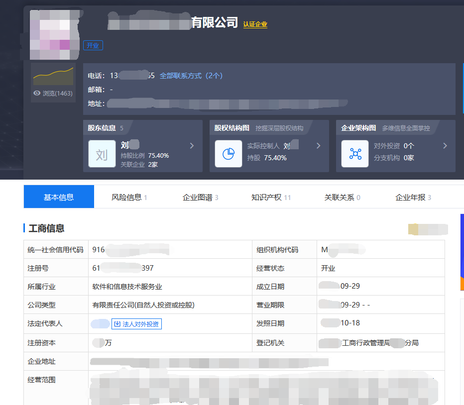
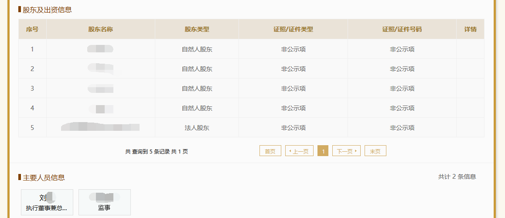

# 交易所安全测试--信息收集

## 一、概述

　　对于所有安全相关的测试来说，信息收集都是非常重要且必要的第一步，有时一次非常全面完善的信息收集甚至会占到一次渗透测试总工程量的的70%到80%，能为后续的工作节省大量精力，提供便利，数字货币交易所的安全测试也是一样，第一步的信息收集至关重要。本文将展示零时科技安全团队的多年攻防经验，以及大量交易所客户真实案例，虽然见微知著，但是通过案例就可以了解到，在安全测试过程中数字货币交易所有什么样的信息可供黑客收集利用以及导致怎样的危害。其中几点将会被单独加以说明，以供参考。

## 二、测试列表

> 信息收集列表
>
> - 域名 Whois及备案信息采集
> - 服务器真实 IP 发现
> - 服务器指纹识别
> - 目标子域探测
> - 邮件服务探测
> - 证书信息采集
> - Web服务组件指纹采集
> - Web网站目录探测
> - API接口信息泄露
> - 端口服务组件指纹采集
> - 旁服信息采集
> - C 段服务采集
> - GitHub/SVN源码泄露发现
> - DNS记录分析搜索引擎公开信息采集（google，shodan，zoomeye）
> - 企业信息采集（员工信息，组织框架，企业法人，企业综合信息）
> - 敏感文件发现

## 三、案例分析

　　关于信息收集，众说纷纭，甚至也有言论称信息收集是测试中用处最不明显的一环，诚然并不是所有信息都是有效且可被利用的，但其中一些确实可以在山穷水复的时候柳暗花明，以致再次找到新的突破口。

　　以下几个案例就将揭示，在测试中，信息收集这一阶段为整个测试过程贡献了怎样的力量。

### 服务器真实 IP 发现

　　开启CDN后的网站，会根据用户所在地的不同访问CDN的节点服务器，并不直接访问源服务器，由于CDN节点的阻挡防护，无论服务器是渗透还是DD0S攻击，攻击的目标都将是CDN节点，可以更好的保护员服务器的安全。  

　　在黑客攻击过程中找到目标真实IP至关重要，攻击者可通过多种方法绕过防护找到服务器真实IP地址。最常见的通过查询历史DNS记录获取服务器真实IP。通过真实IP直接绕过防护，进行端口扫描，服务指纹识别，绕过常规web安全防护，扩大攻击面。

  图下为通过DNS记录获取某交易所真实IP：

### 目标子域探测

　　子域名探测是查找一个或多个域的子域名的过程。这是信息搜集阶段的重要组成部分。子域名探测可以帮我们发现渗透测试中更多的服务，这将增加发现漏洞的可能性，查找一些用户上较少，被人遗忘的子域名，其上运行的应用程序可能会使我们发现关键漏洞。

　　子域名探测的方法有很多，例如：利用DNS域传送漏洞，查看HTTPS证书和枚举挖掘等等。在针对交易所后台发现上，经过大量测试后发现，一部分交易所后台会隐藏在其二级域名下来保证安全。

图下为某交易所后台登录界面，其子域名为 admin的MD5：

　　将后台与主站分离某种意义上，增加了管理后台被攻击者发现的成本，但并不能规避因为自身缺陷造成的安全问题。所以，在保证隐蔽性下的前提下，管理后台可以采用白名单IP访问限制，强密码以及手机令牌等更加安全的登陆方式。

  

### API接口信息泄露

　　API的使用频率越来越高，占比也越来越大，所谓“能力越大责任越大”，安全的API使用固然可以带来极大的便利，但是API的安全一旦出了问题，带来的后果将是毁灭性的。在测试的第一步，信息收集的领域，关于API我们首先能接触到的，就是API具体使用参数等详情的信息保密状态了。

　　零时科技安全团队对某交易所进行安全测试时，发现该交易所的代码是外包公司所编写。在而后的信息收集过程中，零时科技安全团队在google上找到了外包公司编写代码时留下的，托管在某团队协作平台上的API文档。文档中详细地说明了使用API时用到的各种参数及其类型和具体的含义，用处，并且在样例中遗留下了一些测试时使用的具体参数，对后续的测试提供了很大帮助。

### 域名 Whois及备案信息采集

　　虽然现在已经有交易所注册域名时会使用域名注册商提供的服务，没有在Whois等域名信息备案网站上泄露公司或相关人员信息，但仍然有一些交易所会“本尊”亲自注册域名，这时利用Whois或其它的工具就可以找到该交易所域名的注册公司或相关人员的详细信息。而这些不起眼的信息对于后续的测试手段（如密码猜解，社会工程学攻击等）都会有很大帮助，可以极大提高其成功率。

　　零时科技安全团队在对另一家交易所进行安全测试时，根据该交易所在Whois上留下的门户网站域名备案信息，找到了其注册公司，而后又根据注册公司信息找到了该公司经理（亦为股东之一）的手机号，QQ号，微信号和注册人邮箱的一部分。虽然因为授权原因并没有开展后续的社会工程学攻击等测试手段，但在真正需要使用特殊攻击手法时，这些信息无疑会极大提高成功率，能让测试方更从容，更轻松地撕开突破口，完成测试。

### GitHub 源码泄露发现

　　部分开发人员在编写代码时会习惯性地将源码上传到github等代码托管平台上，而这些源码，则是每个测试方都日思夜想要拿到的东西。毕竟，如果拿到了源码，就可以对其进行审计工作，直接找寻编写源码时留下的漏洞和疏忽。这会使得整个测试过程更加容易，减少了很大工作量。同时直接审计源码可以找到的问题和漏洞也会更加全面，具有针对性。

　　同样地，对于交易所所使用的源码的找寻同样是信息收集中重要的一环，如下是在一家交易所网站上找到的/.git源码文件。零时科技安全团队通过审计源码，将审计过程中找到的，存放于注释中的敏感信息和其他审计所得与已发现的漏洞相互验证，成功地在测试中获得了该服务器的控制权，完成了这次测试。

### 敏感文件发现

　　敏感文件的种类很多，其中最经典也往往在测试过程中最能发挥作用的就是robots.txt，sitemap.xml等文件，一些敏感文件甚至可以成为测试的突破口。

　　以下仅以两家交易所网站中robots.txt的部分信息为例。对于测试方来说，获得了这些信息就可以轻松地找到交易所网站中确实存在却不允许被轻易访问的敏感页面。如果这些页面存在某种规律或特点，甚至可以找到其使用的组件，CMS等其他信息，进而更有针对性地进行测试工作。

　　而在针对该交易所的测试过程中，零时科技安全团队也确实使用了其中的信息，配合其他手法成功攻入了该交易所后台。

　　

　　

----

**以上就是本期文章的全部内容。**

　　**信息收集对于测试方来说是测试的第一步，是测试的基础，那么对于交易所方来说，隐藏信息就是保障自身安全的第一步，做好自身信息的隐藏，就能将绝大多数的攻击扼杀在襁褓之中。**    
　　**互联网是一座黑暗森林， 每个攻击者都是带枪的猎人，像幽灵般潜行于林间，轻轻拨开挡路的树枝，竭力不让脚步发出一点儿声音，连呼吸都必须小心翼翼 。**

　　**下一篇文章将会讲述有关于社会工程学的更高级的情报收集，敬请关注。**

