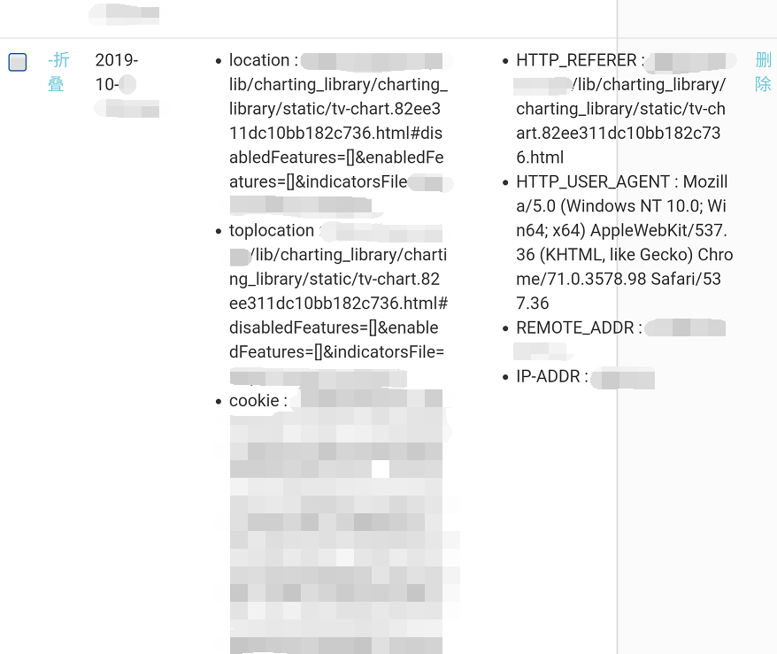
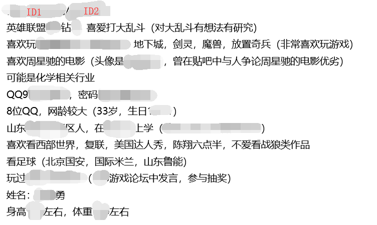

# 0x02社会工程

## 一、概述

社会工程学是信息收集技术的延伸和升级，是一种高级的信息利用手段。系统中最大的漏洞永远是人，社会工程学攻击则是一种高效利用这种漏洞的手段，它看似不起眼，也不专业，也没有技术性，但其实是最有效，最直接的攻击手段之一。

面对机器，一样的输入只有一种结果；而面对人，一样的输入却有千万种不同的反馈，根据这些探索出更深层次的信息，正是社会工程学的魅力所在。以下是信息收集List和社会工程学在测试中大放异彩的案例，供大家参考。（更详细的脑图见附录，仍在更新中） 

## 二、测试列表

> 社会工程学攻击
>
> - 身份信息采集
>
>   - 姓名，绰号，性别发现
>
>   - 学籍履历发现
>   - 曾、现用手机号发现
>   
> - 关系网络梳理
>
>   - 工作关系网络梳理
>
>   - 生活关系网络梳理
>
> - 社交信息发现
>
>   - 朋友圈，QQ空间等遗留信息发现
>   
>   - 其他交友APP信息发现
>   
> - 水坑攻击
>
> - 钓鱼攻击
>
>   - 邮件钓鱼
>   
>   - 网页钓鱼
>   
> - 口令猜解  

## 三、案例分析

就像那个举世闻名的大黑客——凯文·米特尼克至今仍存在争议，社会工程学作为他的主要武器之一，也在承受着人们最大的质疑。人们常言社会工程学不过是“骗术一类”的手段，不足以称之为一种安全技术。诚然，社会工程学不是通常以计算机网络技术为主的安全工作者们所常用的技术，亦非每个安全工作者都有所涉猎，但“ 不管黑猫白猫，能捉老鼠的就是好猫 ”，对于不择手段的黑客而言，能够达成目的的手段，才是最好的手段。 

系统里最大的漏洞永远是人，堡垒往往最先从内部攻破。以下几个案例就将揭示，通过利用人性而实施攻击的社会工程学技术到底会发挥怎样的威力。

### 钓鱼攻击

#### 邮件钓鱼

安全人员在对一家交易所进行测试时，最容易接触到的人就是客服人员，所以负责对外交流的客服也往往成为社会工程学攻击的首要对象。

零时科技安全团队研究员曾对某家交易所进行安全测试，在基础信息收集阶段过后，以及简单的漏洞测试后，发现该交易所的K线存在一个TradingView 的DOM XSS，将漏洞与钓鱼手段相结合对交易所的客服人员展开了社会工程学攻击。由于DOM XSS的payload中的域名与交易所域名相同，对一些不具备高安全意识的客服人员，很容易进入布下的陷阱之中。

下图为零时科技安全团队构造的钓鱼邮件，发给交易所客服人员：

当客服人员打开邮件并点击邮件中的链接时，攻击者即可获取客服人员的登录会话认证，成功控制客服人员账号。

#### 网站钓鱼

在社工的领域里，针对于人的攻击中，最重要的两个点就是信任和需求。

在一次某厂商开发人员授权的测试中，零时安全团队测试人员声称发现了某网址为推特镜像，且在国内也可访问，内容实时更新，并以话术诱导该人员点击进事先准备好的钓鱼网站并尝试性的输入了推特账户及密码。

下图为该开发人员推特账号与密码。

### 身份信息采集

将工作与生活分开，不使其产生交集已经成为当下甚是流行的一种趋势，如，区分开工作与生活各自领域使用的手机，微信，QQ等。这样的趋势看似是职场人工作压力大，切换环境逃避压力的大势所趋，但也不无安全考虑。

零时安全团队在授权测试某家交易所时，找到了该公司相关的某贴吧ID（后经核实，为该公司某管理人员），然后以此ID为基础继续摸索，成功找到了该人员的QQ，手机号和另一私人用ID。因该人员的社交方式并未区分工作与生活使用，根据该管理的手机与QQ号，找到了其他曾注册的论坛ID等信息，并对该管理人员进行心理侧写，猜解出密码为姓名拼音首字母+出生年月日+字符”.“。为后续直接接触后实施的社会工程学攻击手段提供了大量便利。（以下是部分信息）

下图为该人员具体信息。

下图是攻击中获取联系方式时记录。

### 鱼叉攻击

某交易平台于2019年3月被黑客团队利用鱼叉攻击的手段成功入侵。由于某客服人员打开了恶意用户在电报群中投放的捆绑后门的安装程序，随后攻击者获取到了主机权限，通过内网渗透实施入侵并盗取了私钥。

下图为恶意安装程序的安全检测，成功识别为恶意程序：

此攻击团队通过搭建真实网站并运营，减少受害者的质疑，下图为C&C服务器所搭建的钓鱼网站：

---

目前对于钓鱼攻击，鱼叉攻击等社会工程学攻击并没有什么特效的手段。加强人员安全意识建设，不盲目的打开陌生的URL、文档以及文件，对基本的漏洞有简单的认识来规避可能存在的风险。

---

**注：以上所有测试已经过相关交易所授权，请勿非法测试。**

**以上就是本期文章的全部内容。**

**社会工程学是一种针对于人的，高效利用信息的攻击方式。对于测试方来说，它是常能取胜，意料之外的一支“奇兵”；对于交易所方来说，做好工作人员安全意识的培养就是能防奇兵的那道“城墙”。**

**下一篇文章将会讲述有关于逻辑漏洞的内容，敬请关注。**

