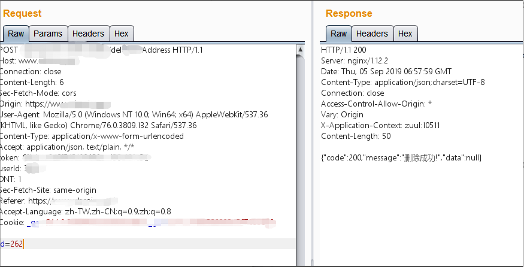
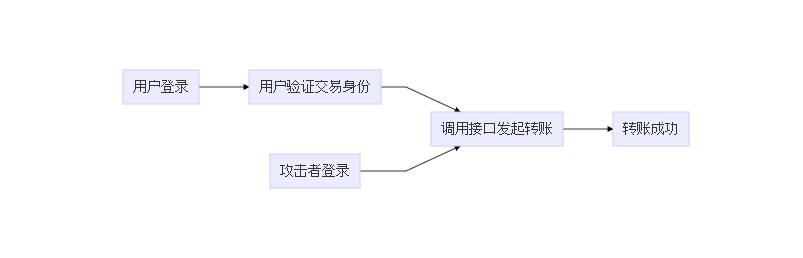

# 0x02 业务逻辑

## 一、概述

对于交易所来说，一个逻辑完备，鉴权完整的交易流程必不可少。业务逻辑漏洞独立与其他服务却又容易受到其他安全问题的牵扰。与SQL注入、XSS等常规web安全漏洞不同，业务逻辑漏洞使用正常的业务流程中的程序固有不足，逻辑设计缺陷等进行攻击，甚至绕过已有安全防护措施，一般防护手段以及安全设备无法防御，因此业务逻辑漏洞一直困扰着广大开发者和安全测试人员。这里给出在经过大量对交易所安全测试后总结出的详细的测试条目，拿出具体案例和大家一起分析存在的安全问题。

## 二、测试列表

> 业务逻辑审计 
>
> - 越权操作测试
>   - 订单越权发起、查看、编辑、删除
>   - 地址越权添加、删除
>
>   - 用户信息越权查看、编辑
> - 工作流程绕过测试
> - KYC认证缺陷测试
>   - 接口识别
>   - 人工识别
> - OTC逻辑缺陷测试
> - 数值精度测试
> - 资产安全测试
>   - 充值
>   - 提现
> - 二次验证绕过测试
>   - Google验证器
>   - 手机及邮箱验证吗
> - 盘口价格设置缺陷测试
> - 假充值测试
> - 短地址攻击测试
> - 数值精度测试

## 三、案例分析

### 越权操作

可能是因为开发人员热衷于打破樊篱 ，所以越权一直是Web安全中老生常谈的问题，并且由于订单、地址、余额和个人信息等等功能的聚集，交易所是越权问题的重灾区。越权漏洞一般分为平行越权和垂直越权两种，而交易所中平行越权占大多数，不仅可以导致越权查看、修改、撤销订单，添加、删除地址以及修改个人信息，而且配合存在的信息泄露问题，可以变相的获取所有用户的KYC信息，因为是正常请求，比起脱裤更难被WAF所发现。

某交易所修改userPhone可以越权让任意用户下单：

某交易所遍历id可以越权删除地址：

根据上述示例可以看出，虽然请求头中含有token和userId等参数，但服务器在接受到请求后并没有将token和userId与body里所携带的id和userPhone进行校验，没有做好鉴权，导致越权。  

### 工作流程绕过

近期零时安全团队在某交易所发现一起由于越权、信息泄露以及工作流程绕过导致的盗币事件。因为事件发生时间太近，不确定厂商是否修复完毕，这里不再披露详细的攻击细节以及截图，简单讲一讲攻击手法。

攻击者在某交易所前端文件中发现了转账时所调用的API接口。按照流程，用户验证身份通过后调用此API转账，但由于验证在前，转账在后，两者并非同时进行，导致攻击者直接调用转账API接口发起转账可以直接绕过身份验证并且可以越权其他用户进行转账。  

造成本次攻击事件的主要原因有三：

> - 前端文件泄露API接口
> - 交易时验证逻辑可被绕过
> - 未能做好鉴权措施

暴露意味着更大的攻击面。隐藏好自己的信息，完备逻辑，完整鉴权，来应对还在潜伏着的威胁。

### KYC认证缺陷  

KYC全称为know-your-customer,  充分了解你的客户 ，了解账户的实际控制人和交易的实际收益人，还要求对客户的身份、常住地址或企业所从事的业务进行充分的了解，并采取相应的措施。

认证作为交易所的重要功能之一，认证方式也百花齐放，常见的有身份证正反面照片，手持身份证照片，手持身份证视频等等。而认证方式有人工识别和接口识别两种，人工识别的准确性取决于审核员当天的心情以及前一天的睡眠，PS加AI换脸的手持身份证照片一般来说可以轻松通过。对于调用接口来进行识别的，有使用百度识图接口来验证，判断身份证照片上的身份证号以及姓名与用户输入的是否相同，来判断是否通过；有需要用户自己掏两块钱来审核的支付宝的人脸识别接口。
下图为某交易所调用baidu API进行KYC认证的前端代码：

对于这种形同虚设KYC认证方式，掌握画图的初级使用技巧即可可以轻松绕过。

### OTC逻辑缺陷

OTC指的是Over-the-counter，场外交易市场， 通常是指店头交易市场或柜台交易市场 。对于交易所来说，OTC指的是用户依托交易所的担保，卖家和买家进行交易。

正常OTC交易流程为：

> 商家卖币  =>  买家购买币并支付 => 商家确认收款 => 系统转账到买家。

而攻击者通过越权：

> 商家卖币 =>  攻击者购买币并不支付 =>  攻击者通过越权点击商家的确认收款  =>  系统转账到买家。

图下为某交易所OTC存在的逻辑缺陷：

利用此类逻辑问题，攻击者可以轻易的不进行支付而直接获得系统转账。此类问题在零时科技安全团体对交易所客户进行安全审计时多次出现，对交易所带来直接的经济损失。

### 二次验证绕过

在安全审计过程中，交易所的二次验证有使用Google验证码以及手机和邮箱验证码，二次验证就是为了保障用户账号安全，已经敏感操作的确认，但是由于设计缺陷将导致二次验证形同虚设。

在工作流程绕过中谈过，如果支付验证与转账操作分为两步进行，就一定需要在转账时对当前用户进行验证以及鉴权来防止绕过和越权。零时科技安全团队对大量交易所进行安全审计时发现，大部分交易所进行转账等敏感操作二次验证时，将验证操作与转账操作通过不同接口隔离实现，导致验证码结构脱离转账操作，失去二次验证的效果；部分交易所虽然服务器验证了手机号与短信验证码的有效性，但是并未验证手机号是否为当前用户所绑定，换句话来说，修改数据包就可以达到使用任意手机号进行验证，从而任意提币；还有更难解释的将验证码填空即可绕过验证。

如下图，某交易所进行提币的二次验证，虽然使用手机和邮箱验证码同时验证，但并未对当前操作用户的手机号绑定进行验证，导致可以使用任意手机号码的验证码进行二次验证，直接提币。

### 盘口价格设置缺陷  

2019年8月23日，由于AWS东京机房硬件设备故障，导致无法连接到服务。部分交易所因使用其他交易所错误的价格数据导致币价出现剧烈波动，BTC成交价最低为0.32USD/BTC，ETH以及EOS均受到影响。

在上游数据错误的情况下，没有对数据的有效性进行判断直接使用导致损失的出现。

在传统安全行业我们称之为供应链攻击，一旦上游的数据、厂商被劫持，修改，对下游没有做好防护措施的交易所将会造成降维打击。

---

**没有绝对安全的系统**

**因为代码之后是人的逻辑**

*注：以上所有测试均已经过相关交易所授权，请勿自行非法测试。*

