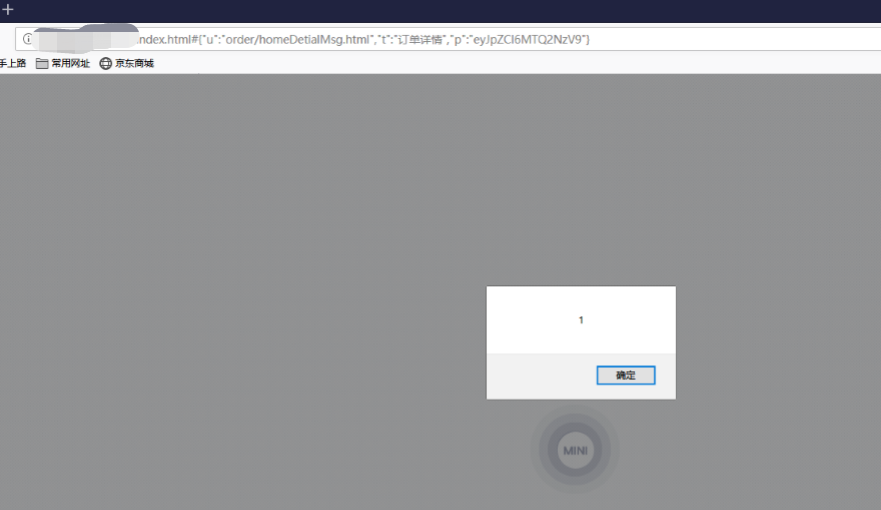
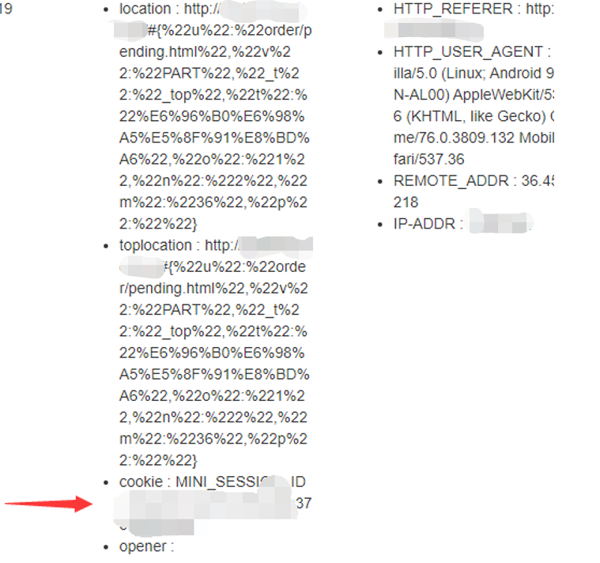
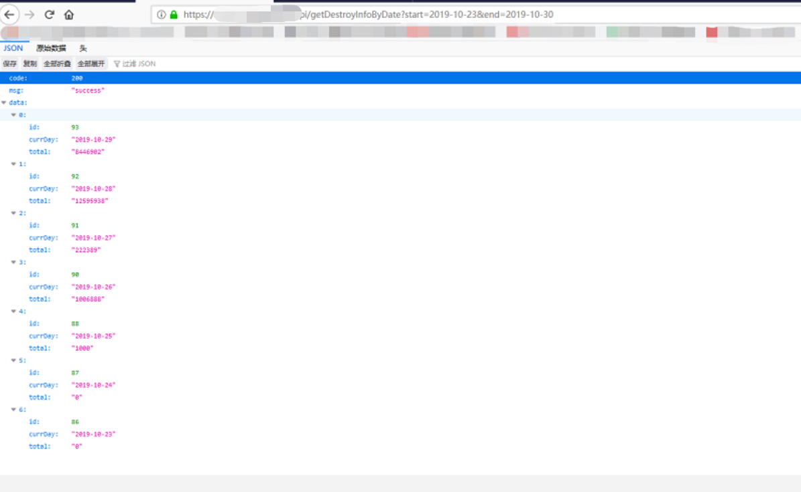
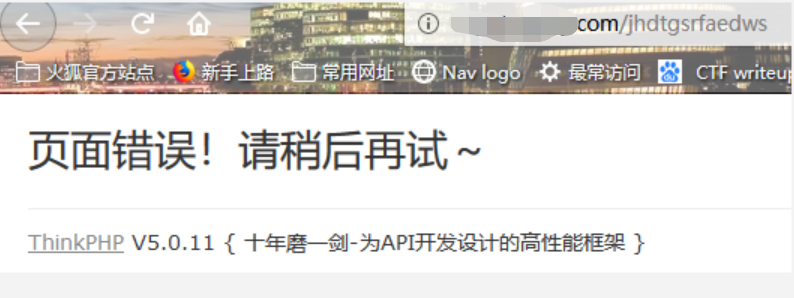
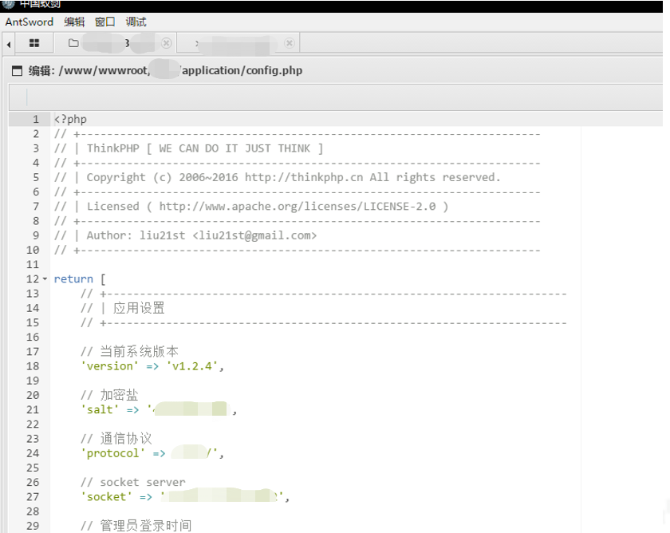

# 0x04 输入输出

## 一、概述

输入输出的安全问题来源于开发人员编码过程中的粗心大意以及应有的安全意识的缺失。这些安全问题对于网站来说是非常严峻的，对数据库，网站管理权限，内网都有巨大威胁。而且利用手法很多，如利用任意文件上传漏洞可直接获取网站shell，利用命令执行漏洞可执行命令反弹shell，利用SQL注入漏洞可查看和修改数据库信息，利用服务端请求伪造（SSRF）漏洞可攻击内网等。因此关于输入输出的安全测试必不可少，并且是重中之重，丝毫不能疏忽和遗漏。以下是对交易所进行测试后列出的详细测试条目，以及一些存在输入输出安全问题的经典案例。

## 二、测试列表

> 输入输出安全
>
> - 跨站脚本（XSS）
> - 模板注入测试
> - HTTP头注入测试
> - HTTP参数污染测试
> - 不安全的HTTP方法测试
> - 服务端请求伪造（SSRF）测试
> - 任意文件上传
> - SQL注入测试
> - XXE实体化测试
> - 反序列化漏洞测试
> - HTTP请求夹带（smuggling）攻击测试
> - 代码注入测试
> - 本地文件包含测试
> - 远程文件包含测试
> - 命令执行注入测试
> - 缓冲区溢出测试
> - 格式化字符串测试

## 三、案例分析

### 跨站脚本（XSS）测试

跨站脚本（XSS）是最常见的web漏洞之一，亦是客户端脚本安全的头号大敌，在各大漏洞提交平台也经常见到XSS的漏洞提交。跨站脚本攻击的危害巨大且可利用处繁多：如XSS钓鱼，Cookie劫持，获取用户真实IP等操作。

零时安全实验室在对某交易所进行测试时，发现在资产充值的付款钱包地址处，可以输入任意字符，并没有对输入的字符进行过滤和编码。初步测试时弹框成功，进一步写入利用XSS获取cookie的脚本。等待一段时间后，成功获取到后台管理员cookie，并以此登录后台成功，其后台可进行任意转账和充值操作，且存在大量用户信息。

下图为测试XSS时截图：

​	

  成功弹框

成功获取后台管理员cookie：

用管理员cookie登录后台

### SQL注入测试

数据库（SQL）对于开发者和网络安全人员来说，应该是非常熟悉了。OWASP TOP 10多次把数据库相关的SQL注入攻击列在榜首，也足以见得其危害。SQL注入漏洞的产生主要是因为Web应用程序对用户输入的数据没有进行合法性判断，攻击者可以控制前端传入到后端的参数，利用参数代入数据库查询，通过构造不同的SQL语句实现对数据库的任意操作。鉴于其危害性巨大，零时安全实验室在对交易所测试时，对SQL注入类漏洞会进行全面细微的排查。

零时安全实验室被授权测试某交易所时，在一个提交GET请求的数据包中，发现疑似的注入点。进行手工测试后，验证存在延时注入，后使用工具进一步测试，得到了数据库表，用户名，密码等数据库存储的相关信息。

下图为手工注入测试过程：

工具测试过程：

### 代码注入测试

代码注入漏洞与SQL注入漏洞同隶属于注入类型，其危害也相当巨大，是经常被攻击者能用来拿下网站权限的“利器”。这种漏洞的产生大多是因为部分开发人员的编程习惯并不安全，例如经常使用一些类似于eval()，system()的危险函数等。下面用一个实例说明一下此类漏洞的危害。

零时安全实验室在对某交易所进行测试时，发现交易所的某相关域名下报错信息提示中间件及版本为Thinkphp 5.0.11，随即利用其已公开的一个代码执行漏洞写入shell，连接成功后拿下网站权限。

访问网站不存在的目录，管理员开启了debug信息：

根据ThinkPHP相关版本漏洞，验证漏洞是否存在，可以看到禁用方法：

写入木马后，连接成功，拿到网站管理员权限：

---

**人和机器总是要产生交互**

**交互就意味着危险**

**有输入输出的地方就是危险的多发地**

*注：以上所有测试均已经过相关交易所授权，请勿自行非法测试。*