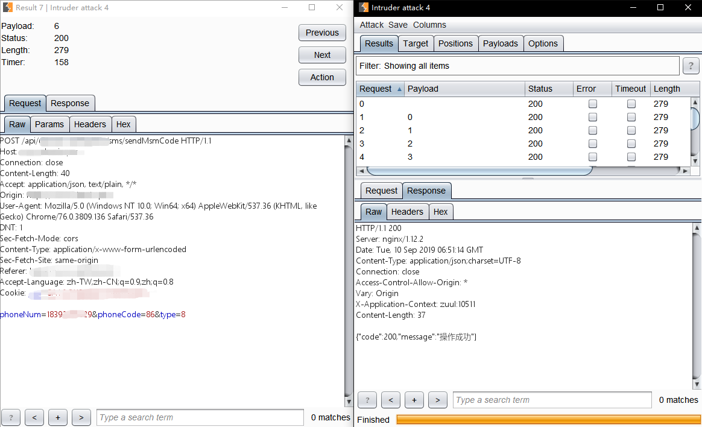
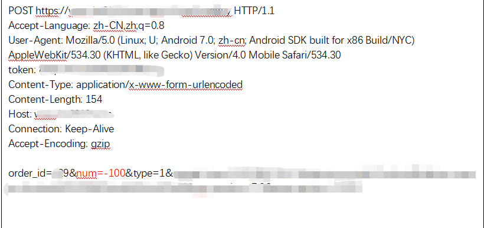

# 0x06 接口安全

## 一 、概述

API，英文全称Application Programming Interface，翻译为“应用程序编程接口”。是一些预先定义的函数，目的是提供应用程序与开发人员基于某软件或硬件得以访问一组例程的能力，而又无需访问源码，或理解内部工作机制的细节。 由于其快速、有效和安全、可靠 的特性，被开发人员广泛的使用。但如果接口本身没有做好安全防护或者调用时没有做好频率限制，都会导致问题的出现。

零时科技安全团队在经过大量对交易所的测试后，总结出了针对各类接口的测试列表，如RPC、Web Service、RESTful API和GraphQL等。下面案例分析中将会详细讲述有关交易所存在的接口安全问题。

## 二、测试列表

**接口安全**

- RPC安全测试
  - RMI远程命令执行
  - CORS
- Web Service安全测试
  - SQL注入
  - 信息泄露
- GraphQL安全测试
  - 未授权访问
  - 信息泄露
  - GraPhQL SQL注入
  - 嵌套查询DOS
- RESTful API安全测试
- 数值精度测试
- 接口频率限制测试
  - 邮箱验证接口
  - 短信验证接口
  - 批量刷单
- 超时检测

## 三、案例分析

### 数值精度测试

零时科技安全团队对某交易所进行测试时发现，其默认小数点精度为4位小数点，大于4位小数的会往前四舍五入，比如0.9999系统会默认为1，由于此精度问题，导致可被攻击者薅羊毛。

攻击者可以开两个账号，一个挂单（无需认证即可挂单），一个出售，配合无限薅羊毛。

虽然单次获取收益很小，但是无限制的话，收益还是不错的。

通过大量无限制刷单，可以套取系统中心账号代币，攻击者可以出售代币套现跑路。

如下图所示，批量下单0.9999个代币，当15分钟后，系统默认取消交易，然后钱包中心钱包将返回1个代币给卖家，获取额为代币：

建议严格按照4位小数精度进行算术运算，并对下单频率以及数量进行限制。

### 接口频率限制测试

#### 邮箱验证接口

在进行身份甄别时，邮箱验证码因其免费的缘故被广泛使用。但是在开发过程中没有正确的限制接口频率，就可能被利用进行电子邮箱炸弹攻击。电子邮件炸弹是最古老的匿名攻击之一，通过设置一台机器不断的大量的向同一地址发送电子邮件，攻击者能够耗尽接受者网络的宽带。 

#### 短信验证接口

与上述所说的邮箱验证相同，因为短信验证的方便快捷以及安全性较高也被广泛的用于身份验证中。与邮箱验证不同的是，短信验证码的条数是需要按照数量付费的。如果未进行合理频率限制会导致：

- 持续给手机号发送垃圾短信，造成极差的用户体验。

- 对于公司来说，发送短信一般借助第三方运营商，每条短信需要支付费用，如果一天被刷几十万条，一天造成上万的亏损。

#### 批量刷单

零时科技安全团队在对某交易所进行安全测试时发现，可不停购买数量为负数的代币，然后确认付款，在商家后台无法进行确认收款，可以批量生产垃圾订单，而且会导致短信炸弹。请求如下：

此漏洞是由于可以接受非法参数以及未作频率限制共同造成。不仅影响到业务流程的正常运转，而且耗费了大量的短信资源。这种类似于薅羊毛的技术单次看来危害较小，所以经常会被忽略，但如果被无限制的利用，羊毛出在羊身上，终有秃噜皮的一天。

---

**君子生非异也，善假于物也。**

**诚然，善于调用各种接口会大幅提高开发效率，但在使用前应充分了解接口的运作机制，进行合理的调用限制。**

**免得猛虎下山，反噬其主。**  

*注：以上所有测试均已经过相关交易所授权，请勿自行非法测试。*