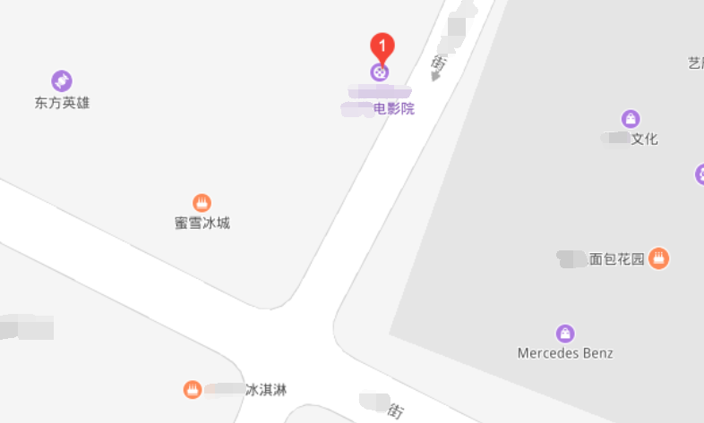
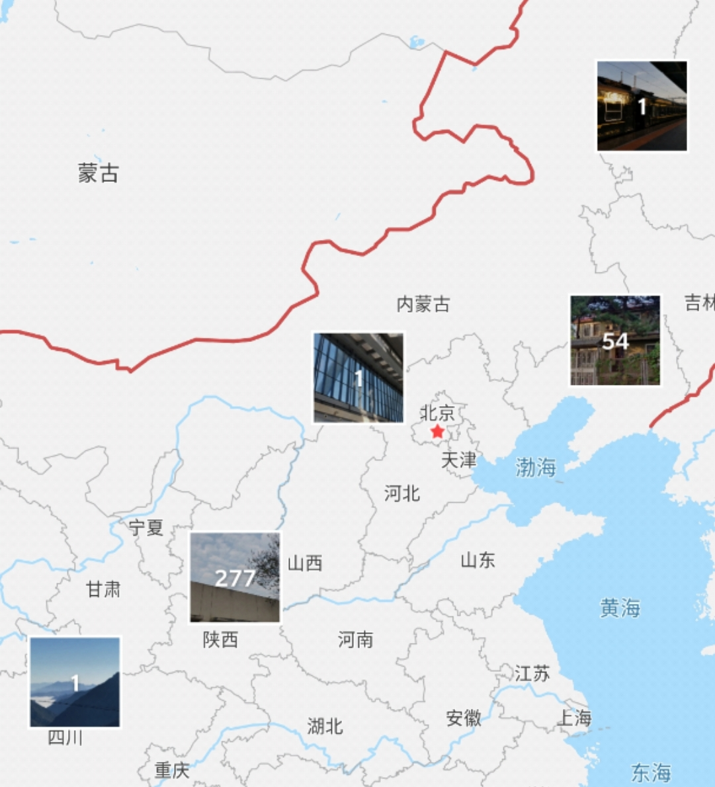
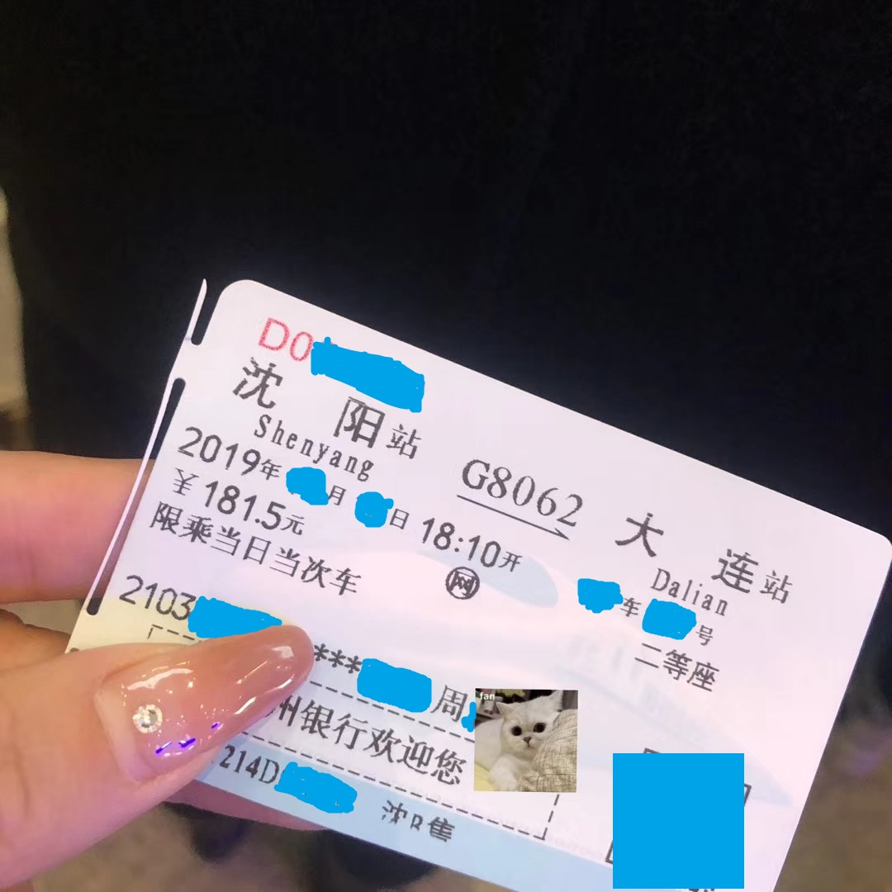
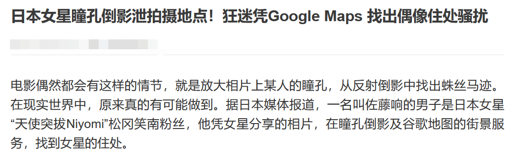
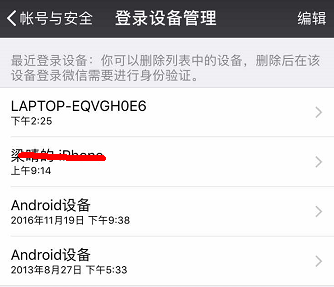
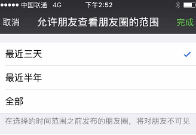
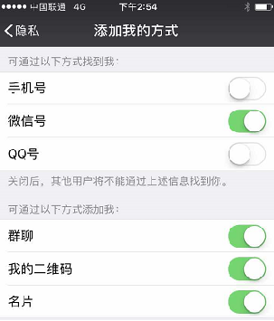
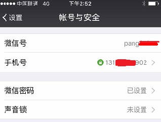
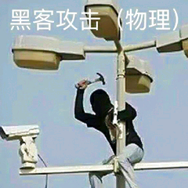

## 网络安全意识 | 线上社交竟潜藏如此恶魔...

**顾名思义，本系列文章主讲“安全意识”，而本期文章将主要讲述线上社交方面的安全意识问题。**

如今，一个系统整体的安全性已经越来越强，面对纯技术层面攻击的“机器”也已经进化的越来越安全。但是，就像一个人拿着世界上最好的钓鱼竿也不一定就可以钓到鱼一样，仅仅是持有最好的工具是没有用的。手握利器也没法做大侠，只有自己武功高了才能保证不给武器拉胯。

相对应地，无论一家公司，一家机构，一个系统的安全性看起来有多高，如果系统里的人没有安全意识，这个系统仍然是危险的，在一个资深的安全工作人员眼里，无异于一块放在玻璃柜子里的肉——**看着护得挺严实的，其实，也就那么回事吧......**

就像在安全行业里一句口口相传的话所讲的那样，**根本没有绝对安全的系统**。但这样是否就代表着，“反正怎么样都不绝对保险，那还管他干嘛嘞”？

答案肯定是不对啦！于此可以套用密码学的理论，即“攻击收益小于攻击成本时，密码（系统）就是相对安全的“。会有人印制成本为200块钱的100元假币吗？会有人用一个月的时间破解当周的彩票中奖号码吗？在安全方面，也是同理。

因此，本期或本系列的文章，主旨也并不在于促使观众所在的系统成为绝对安全的系统，而是使其开始对潜在身边的危险产生觉知，使自身成为相对安全的系统。

（假币那句删一下谢谢）

**接下来直入正题！**

本文将社交安全的安全意识分为线上和线下两个部分，首先我们先讲述线上社交的安全意识问题。

线上社交，广义地讲，即是通过网络等渠道，非面对面直接交流的社交方式。

如今社交媒体已经相当发达，大家也都愿意在上面分享自己的生活。诚然，每个人都愿意在社交媒体上分享自己美美的照片或者是深夜工作结束后的智者感悟鸡血鸡汤。但是，请记得规避泄露有价值信息的风险，因为**当看到你深夜在办公室拍的照片时，会感动的不仅是你的老板，还有黑客。**

真正的恶意攻击者是贪婪的，他们为了达成目标会不择一切手段，不放弃一切信息。所以，如果你想保证自家公司的绝对安全，如果你想提升自己的安全意识，就不要忽视所有能被提供出去的信息的重要性，攻击者能拿到的所有相关信息都有对应的价值。

接下来我们来主要谈一谈，你在社交媒体中可能会泄露信息的配置，泄露点，和那些有用的信息本身。

比较常用的社交软件主要分以下几类：QQ，微信，微博以及其他社交软件。

## QQ

当黑客决定对一个公司/系统的员工/成员下手的时候，很好用的一个办法是伪装一个身份与目标直接接触并进行一些有目的性的交流，那么收集一些能够便于伪装身份的信息就是很有必要的了。QQ是一种相当古老的通讯软件，**使用时间长的用户也会在上面留下足够多的的信息**，以至于说，QQ上的所有信息整合起来就基本相当于一个人的小型履历。

其中，QQ空间是第一个“重灾区”。

一个安全意识不很强的人的QQ空间，可能会包含以下几点有价值的信息。

#### 1.个人履历

一个人的QQ空间很有可能会包含他高中，大学等的个人成长经历，也有可能暴露他**对应时期的关系网络**和当时所发生的让人印象深刻的事情。这些都有助于恶意攻击者伪装成另外一个人接触目标，用过往的共同经历和合适的绰号，称呼非常有利于快速拉近双方距离。经典的“小王啊，来我办公室一趟”，“听不出来了吗，我是你老同学啊，我们还一起打怪升级来着”，就属于类似的攻击手段。当然一般来说实施这些手段的攻击者大多属于广撒网，并没有对目标进行针对性的了解，属于比较拙劣的攻击就是了。

#### 2.个人信息及关系网络

姓名，年龄，样貌，职业，职称，家庭组成，公司阶级构成，工号学号组成规律等。

#### 3.活动范围

笔者前几天发现，自己手机相册里有一个“地点”的功能，这个功能会收集照片的位置信息，并在地图上放上对应的照片，这样就会大致勾勒出一个近几年的活动范围（关于照片位置信息请看下一点）。**QQ空间里的相册，说说**整合起来，也会勾勒出一个类似的活动范围，它会让你的行踪暴露在外。目标在什么时间会经常出现在什么地点也会被攻击者了解，便于攻击者猜测你的生活习性和爱好等。比如下图（电影院地址和蜜雪冰城），就能让人捕捉到目标经常活动的地点，便于“踩盘子”，守株待兔。

#### 4.活动范围（进阶）

比较易于发现的活动范围可能是依靠所发布动态的GPS定位，图片里易于发现的标志性建筑物等采集的。但也有一些更隐蔽的不易被人发现的方式，比如选择原图发送图片时，图片很有可能会藏有包含经纬度位置信息的**EXIF信息**，通过精准的经纬度信息，可以轻易定位你的位置。当然了很多软件都对**EXIF信息**有操作，一般编辑过，美化软件美化过的图片会抹除它，所以和QQ好友聊天时不妨也发一些修改过的，美美的照片，不失为一个安全的好习惯哦。

除了以上提到的以外，还有一些其他可能暴露有效信息的点，比如QQ签名，留言板等，以下将给出一些具有针对性的建议。

1.发布图片时，重要信息务必打码；

2.尽量不在动态中暴露定位信息；

3.使用过“附近的人”功能者，应清除地址信息后退出；

4.尽量不发送照片原图，或编辑修改后再发送；

5.不要在公开社交网络中暴露公司敏感信息；

6.尽量不要在空间中暴露真实姓名；

7.不要在QQ签名（包括签名历史），留言板中泄露敏感信息；

8.不要使用QQ空间中照片人脸识别后贴备注的功能；

9.尽量关闭通过手机号查询到用户的功能；

10.名片夹中“标签”功能尽量不要暴露个人照片或敏感信息；

**11.安全问题的本质是信任问题，不要轻易相信陌生人，或对涉及到公司内部情况等的敏感信息做到闭口不谈（如果没法做到防守好每一条可能被攻击的渠道，就坚守最根本的不能放手的部分）；**

12.设定好空间开放权限，至少非好友不能访问；

13.尽量减少信息流出，有条件的话设置向外开放的时间范围，如只展示半年内的动态；

14.适当管理留言板等公开交流渠道的内容；

15.在熟人情况异常或开始涉及敏感信息范围时，请多渠道核实真实情况；

16.尽量少地在个人信息处留下真实信息；

17.事出反常必有妖，有便宜占时请及时核实真实情况，不要贪心；

**18.相信直觉，一旦起疑就及时进行核实，在涉及到敏感范围时，任何人都是不值得信任的。**

**只要与外界交流接触就难免流出信息，只要有信息就难保没有价值。滴水不漏的防御要比专注一点的攻击难做得多，真正做到极致的安全是非常严谨苛刻甚至反人类的。**

所以以上建议并**不必不变通地完全100%执行，按照自身需要安全等级适当调整完成度**，就已经比其他无安全意识的厂家好上很多。启蒙不是对光明的想象，而是对黑暗的觉知。虽然提升安全意识并不能帮助大家直接变成安全达人，但提高了个人/企业员工的安全意识就代表黑客攻击成本上升，被攻击概率下降。

## 微信

微信逐渐受到大众青睐，慢慢成为了办公使用的重要通讯工具之一，虽然在内容丰富度上不比QQ，但由于其职场使用频率高，以及比QQ更加具有私密性的特点，在重要性方面还犹过之。

比如下面，就是一个暴露自身信息的例子。虽然看起来该藏起来的信息都藏好了，但实际上藏起来的也就是4位生日而已，非常好猜解，或者通过别的渠道取得也是很容易的。真正重要的身份证号随机数全都暴露在外。

而下面的例子也将告诉你，用社交媒体里的图片找到真实地址也并非空穴来风。

微信的大体情况和QQ类似，也就不再赘述，以下给出一些针对性的建议：

1.发布图片时，重要信息务必打码；

2.尽量不在朋友圈中暴露定位信息；

3.使用过“附近的人”功能者，应清除地址信息后退出；

4.尽量不发送照片原图，或编辑修改后再发送；

5.不要在公开社交网络中暴露公司敏感信息；

6.尽量不要在朋友圈中暴露真实姓名；

7.事出反常必有妖，有便宜占时请及时核实真实情况，不要贪心；

8.经常管理微信登录设备；

9.有条件的话，请设置好友可查看的动态时间范围（非好友最好不可查看）；

10.尽量关闭通过手机号，QQ号查询到用户的功能；

11.微信号尽量不要暴露个人信息，如姓名缩写等。

## 其他非线下社交渠道

在社交软件方面，以上两者以外的社交软件种类繁多，不便一一说明。但万变不离其宗，最根本的宗旨只有一个（说来简单做起来难啊）——**严防死守一切你认为可能造成危害的敏感信息，不轻易暴露真实信息，不轻易信任他人，谨慎谨慎再谨慎。**

不仅社交软件，电话有时都是不值得信任的，甚至说，线下见面都未必真实，除非你能保证他真的是他。

 

线下社交的问题将在后续文章中细说而在此不表。在本文结束之际再次重申线上社交安全的几点准则，请大家务必牢记：

**有任何涉及到敏感信息或者公司安全的情况，杜绝“自以为”，务必及时通过多渠道核实真实情况；**

**禁止无条件的信任，不轻易暴露真实信息，不轻易泄露机密敏感信息。
**

***真正做到极致的安全可能无法与业务或正常生活并存，但也不代表可以完全不管不顾。做到条件允许的，最好情况的安全即可。***

（对于人来说，不和外界接触最安全；对于机器来说，网线拔了最安全......算了网线拔了都不一定安全，无论道高多少尺，魔总能高一丈，绝对的安全是不存在的。）

最后送上一句话，作为本文的宗旨，希望大家喜欢这句话，也喜欢零时科技安全团队本系列的文章，谢谢大家：

### 启蒙不是对光明的想象，而是对黑暗的觉知。