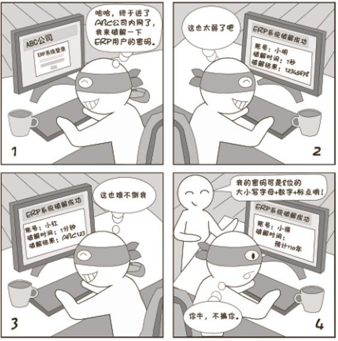
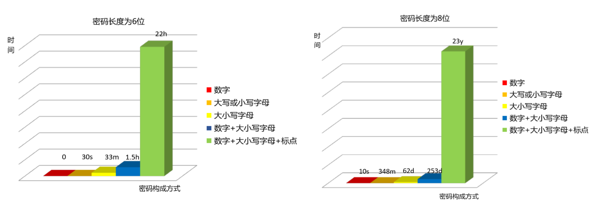

# 网络安全意识 | 震惊！密码保护竟然是个圈

除了单纯的浏览以外，所有人想在网络上留下自己的痕迹，或是更好地使用网络应用程序（发帖也算使用网络应用程序），最不能缺的就是**账号和相对应的密码**。甚至可以说，一个账号就代表了一个你在网络上的身份。那么说到这，账号密码有多重要就不必多说了。（还不明白的大概是没被盗过号吧...）

在这个信息化时代，各类交流平台以及各种工具平台都是通过账号密码进行验证和登录。账户安全的重要性不言而喻，它的范围之广，关系到每一个人，包括个人手机APP账户、电脑网站账户、银行卡账户密码等一些账户信息以及一些与区块链相关的助记词，密钥等信息。如果这些信息被泄露或者是被不法分子利用，将会造成不可挽回的损失。

## 传统账号密码

对于个人而言，一次不安全的密码设置可能会导致个人账号被盗，个人信息泄露，严重也可能导致个人财产损失；对于一个网站而言，一次不安全的密码设置可能导致黑客拿到网站管理员权限，泄露大量信息等一些危害操作。大概如下图所示（此图来自绿盟科技）：

这里附一张破解密码时间图，如图可看出，由数字和大小写字母及标点组成的8位密码，破解时间相比其他简单密码瞬间突增，将盗取密码者望尘莫及。有的人可能会认为破解者要是执着一直破解，你放心，破解者可能会执着，但他不会一直，所以将自己密码设置为高强度，使自己账户更安全，让盗取密码者望而却步。

2014年12月25日，12306网站用户信息在互联网上疯传。对此，12306官方网站称，网上泄露的用户信息系经其他网站或渠道流出。据悉，此次泄露的用户数据不少于131,653条。该批数据基本确认为黑客通过“撞库攻击”所获得。信息来源：https://baike.baidu.com/reference/16480882/f6aadTCagnZohmKjOge7tuJcAyxBp1cC1NWcssxVZ04mbBg7TmQKIDf-eXNj6DevGSXjUnLoV24NBHFOrTaEPAy1-l5z

对于大多数用户而言，撞库可能是一个很专业的名词，但是理解起来却比较简单，撞库是黑客无聊的“恶作剧”，也是一种领先时代的攻击技术，黑客通过收集互联网已泄露的用户账号及密码信息，生成对应的字典表，尝试批量登陆其他网站后，得到一系列可以登陆的用户。类似于的撞库事件，个人用户应该怎样减少自己的损失。第一点：对于自身的口令密码，每个网站应设置不同密码，或进行密码分级，例如：涉及资金的密码设为一类，通讯账户密码设为一类等，如果一个密码泄露也不会导致其他账户被盗。第二点：对于自己的账户密码，尽量不要发送给他人，避免出现账户密码泄露。

以下是零时科技安全团队对于账户密码设置的安全建议，对于个人自身安全的账户密码设置，有则改之无则加勉，从实际出发，帮助大家设置安全的账户密码。

### 账号密码安全建议：

1.保守口令密码，不告知他人。

2.避免单纯使用个人信息设置密码，如：自己的生日、配偶的姓名等。

3.不要单纯使用字典中的单词。

4.密码长度八位以上。

5.密码包含大写字母以及特殊字符， 不使用弱密码，如123456，1234qwer；使用强密码，如  Wyh0056..，...Cyy600!。

6.定期更换密码。

7.将自己的各类密码进行分级管理，如：

​    一级密码：网银，支付宝等设计资金的账户；

​    二级密码：密保邮箱；

​    三级密码：即时通讯，微博，微信；

​    四级密码：各类论坛账号。

​    每级密码各不相同，万一泄露也不至于“一损俱损”。

## 助记词，私钥

区块链是近些年来萌芽发展的行业，从2009年1月3日第一个序号为0的创世区块诞生，几天后2009年1月9日出现序号为1的区块，并与序号为0的创世区块相连接形成了链，标志着区块链的诞生，从此逐渐诞生了BTC，ETC，EOS等数字货币，随着数字货币的出现，各种存储和管理数字货币的钱包也随之出现，助记词私钥也逐渐进入人们的视野。

### 公钥和私钥

公钥(Public Key)是和私钥成对出现的，私钥可以生成公钥，公钥无法倒推得到私钥。公钥能够通过一系列算法得到钱包的地址。
私钥(Private Key)是一串由随机算法生成的数据，它可以通过非对称加密算法算出公钥，公钥可以再算出币的地址。私钥可以控制自身的数字货币资产。

### 助记词

助记词是明文私钥的另一种表现形式, 目的是为了帮助用户记忆复杂的私钥 (64位的哈希值)。助记词一般由12、15、18、21个单词构成，单词的生成顺序也是按照一定算法而来，安全性有保障。助记词和 Keystore 都可以作为私钥的另一种表现形式,，但与 Keystore 不同的是，助记词是未经加密的私钥，如果其他人得到了你的助记词, 就可以盗取你的数字货币资产。

虽然越来越多的人开始接触区块链，但是对区块链的相关知识了解较少，对于区块链的安全意识也比较薄弱，使得攻击者有机可乘，特别是对于助记词，私钥的安全保存。在很多新用户的潜意识中，仍旧会把钱包当银行看，觉得提供手机号、身份证、护照等所有能证明自己个人身份的东西就可以找回资产，但是如果丢失了助记词备份，那些钱包里的钱就再也找不回来了。还有一些人没有恰当的保存和传输助记词，截图后通过微信，QQ，网盘和邮箱等设备传输或存储，如果自身有错误操作使得助记词泄露，也会导致个人资产损失。

就比如我，刚开始接触区块链时，对ETH很感兴趣，就尝试买了一点ETH，再后来也买了EOS，本以为自己不用管，价格就会涨（心里想）。没想到用的那天，发现自己把助记词找不到了，记得当时直接电脑截图后放在桌面，却再也没找到。属于自己的钱就这样没了，蓝瘦。

鉴于经常出现助记词，私钥泄露和丢失等问题，零时科技安全团队为大家提供以下安全建议，即可提升自身的安全意识，同时也可以保障了个人资产。

### 助记词私钥存储建议：

1.私钥一定要手抄。

2.多个安全地方存储。

3.确保助记词的准确性，多次校验。

4.或者强加密后存在电脑。

5.不要截屏和拍照，会同步到云端。

6.不要拷贝粘贴，会同步到云端。

7.不要使用邮件传输或存储私钥。

8.不要将私钥发到群里。

9.不要将私钥导入未知的第三方网站。

10.不要在被偷看，监控状态下显示私钥，输入密码等。

11.不要将私钥告诉身边的人。

12.不要使用社交网络传递，如：QQ，微信，信息根本不安全。

13.不要在越狱，root的机器上安装各种数字货币钱包。

14.不要明文存储在电脑，电脑可能有木马等软件。

15.大额资产建议用冷钱包。