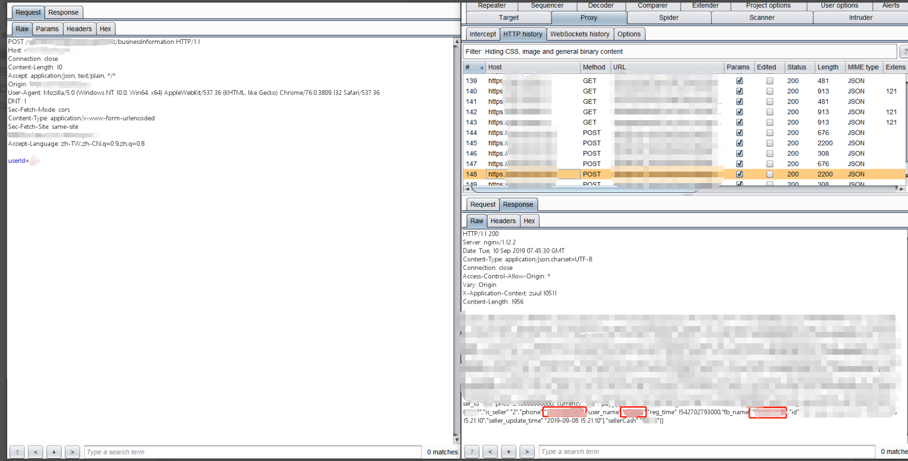
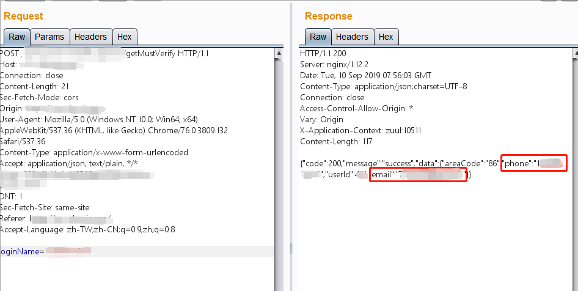
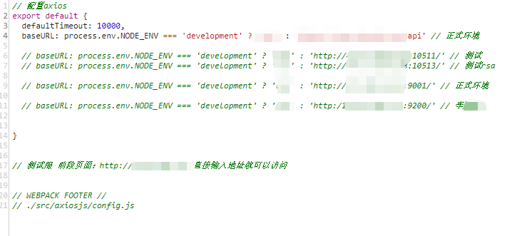
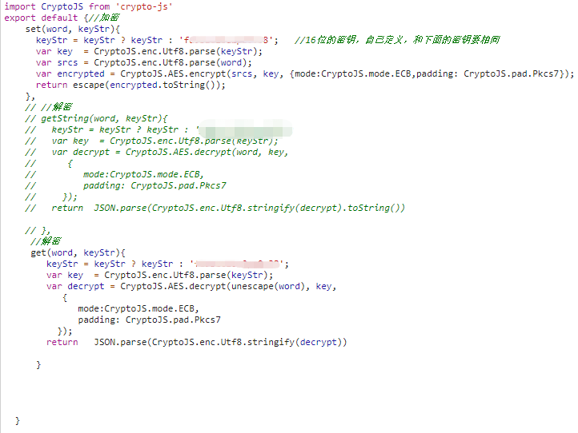
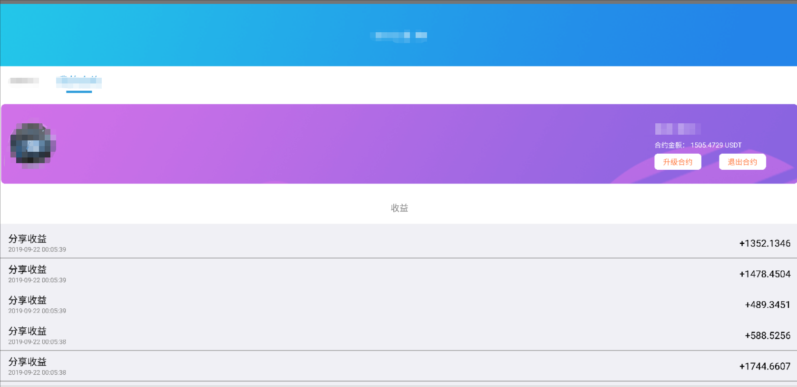

# 0x03 信息泄露

## 一、概述

信息泄露在安全审计中屡见不鲜，对于存有大量用户KYC信息的交易所来说影响更加深远，是非常严重的安全问题。零时科技安全团队在审计大量交易所后发现，信息泄露问题一般集中于交易所的账户体系、OTC交易系统、用户订单、邀请列表和网站源代码等地方。造成信息泄露的主要原因一般是由于服务器响应包内容没有经过处理就将用户的所有信息返回，配合其他漏洞甚至可以批量的获取用户敏感信息，除此以外，对善于掘金的攻击者来说网站前端源码可谓是遍地黄金，大量敏感信息的注释（测试账户、内网IP、测试地址、测试token等等）没有在进入生产环境时被删除。

## 二、测试列表

> 信息泄露
>
> - KYC信息泄露
>   - 登录注册
>   - 忘记密码
>   - 邀请列表
>   - OTC交易系统
>   - 用户订单
> - 前端源码信息泄露
>   - 测试数据泄露
>   - 敏感信息泄露
>   - API接口泄露
> - Github信息泄露
>   - 数据库文件/连接凭据
>   - 敏感信息泄露
> - 敏感文件信息泄露
>   - robots.txt
>   - crossdomain.xml
>   - sitemap.xml
>   - .git/.svn/.bak

## 三、案例分析

### KYC信息泄露

在业务逻辑文章中曾经讲过KYC认证缺陷 ，指的是用虚假以及非法的信息来绕过交易所的KYC认证。而对于使用真实KYC信息认证的用户，KYC信息本身的安全性显得尤为重要。

#### 忘记密码

某交易所在用户忘记密码时未对响应包进行处理，当输入邮箱或者电话号码进行找回密码操作时，服务器将用户的uid、mobile、name、nickname、email、qq、wexin、identitycardnon（身份证号）以及googlesecret一并返回，造成了极其严重的KYC信息泄露：

#### 邀请列表

某交易所在用户查看邀请人列表时没有对服务器响应包内容进行处理，导致查看邀请列表时会泄露所有被邀请人的KYC信息包括uid、mobile、name、nickname、email、qq、wexin、identitycardnon（身份证号）以及googlesecret等。利用存在的越权漏洞，可以遍历收集所有被邀请用户的KYC信息：

*注：由于敏感性原因暂不放出收集结果以及具体细节*

#### OTC查看商家/订单

某交易所在用户查看OTC订单处存在信息泄露，服务器的响应包里将商家的id、qq、alipay、whatsApp、nickname、mobile、wechat、telegram、username、realname、skype和email全部返回，只要遍历订单就可以获得所有商家的个人信息：

#### 信息泄露攻击链

零时科技安全团队在对某交易所进行安全测试时发现，该交易所在用户查看OTC商家的信息时，遍历userid便可以获得所有商家用户的phone、username和nickname。收集到所有泄露的商家phone后，经过测试又在忘记密码处发现信息泄露，只要输入手机号就可以获得商家的userid以及email，通过两个信息泄露漏洞构成的攻击链同时进行收集，最终收集到所有商家用户的真实姓名、电话号码、邮箱地址以及昵称。

下图为通过遍历userid获取所有商家的phone和username:

下图为通过收集到的手机号码来获取商家的email以及userid:

也许某个点的信息泄露看起来微不足道，一旦点与点之间连成线，对于攻击者来说这两个点确定的可不只是一条有始有终的线段，而当这条攻击链被利用起来的时候，便是条有始无终，直至目标的射线。

### 源码信息泄露  

在开发过程中，开发与测试人员为了能够更加轻松地了解以及调试代码，通常在开发与测试阶段在代码中留下大量注释信息，其中不乏有测试用IP地址，测试端口，测试用账户，测试用token和测试用API等等。

编写注释对于广大开发与测试人员可以提高代码的易读性以及开发效率，可算是与人方便，与己方便的好习惯。可一旦这些方便的注释经过开发环境、测试环境到达了生产环境，在公网上暴露出来，方便的可就不只是兢兢业业的开发者与测试者，还有在黑暗中隐藏行踪，时刻紧盯着目标的攻击者们。

在经过对大量交易所测试后发现，开发与测试人员可能是世界上最具有开源精神的一批人，有的喜欢将自家网站的内网拓扑以及测试接口开源出来供大家欣赏。

某交易所源代码中存有大量含有测试用接口，IP地址的注释：

有些喜欢将自家的加密的密钥开源出来供大家使用。

某交易所源代码中含有AES加密的硬编码密钥，导致数据加密被破解：

而有些不仅直接将自家测试用token放到源码里，还向账户里进行充值，可谓是：“弱水三千，任君自取”，不过君是不是“只取一瓢饮”那可就不知道了。

某交易所源码中含有测试用JWT，修改后可成功登录账户，控制资产：

使用测试用JWT登录账户，控制资产：

诚然，详细而又全面的注释是开发与测试人员良好的代码编写习惯，不过要记得在经过开发环境与测试环境后，进入生产环境之前，将所有可能会暴露到外界的含有敏感信息注释删除，以防敏感信息泄露。在GitHub上开源是好事，但也要记得上传之前仔细检查，不要将自家的数据库地址与密码一同开源出去。

---

**对于交易所来说，不辜负用户的信赖，保护好用户给予的个人信息，应该是安身立命之本。**

**对于开发人员来说，要做好差别对待，保护好代码安全，给用户良好体验的同时，不要攻击者有着同样良好的渗透体验。**  
*注：以上所有测试均已经过相关交易所授权，请勿自行非法测试。*