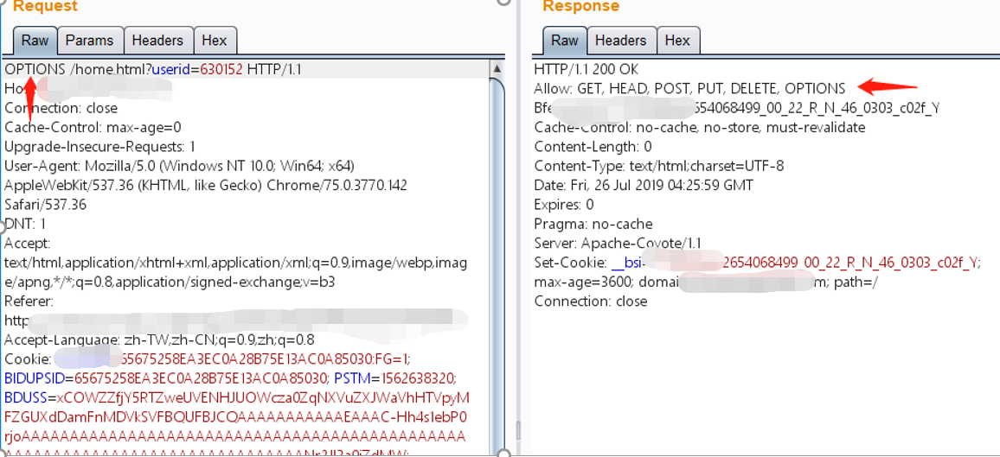
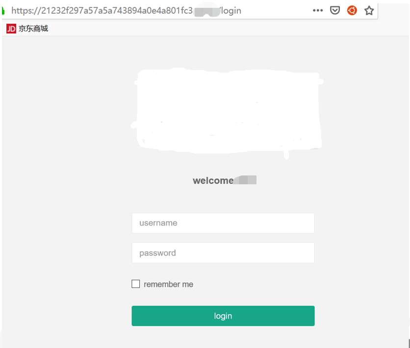
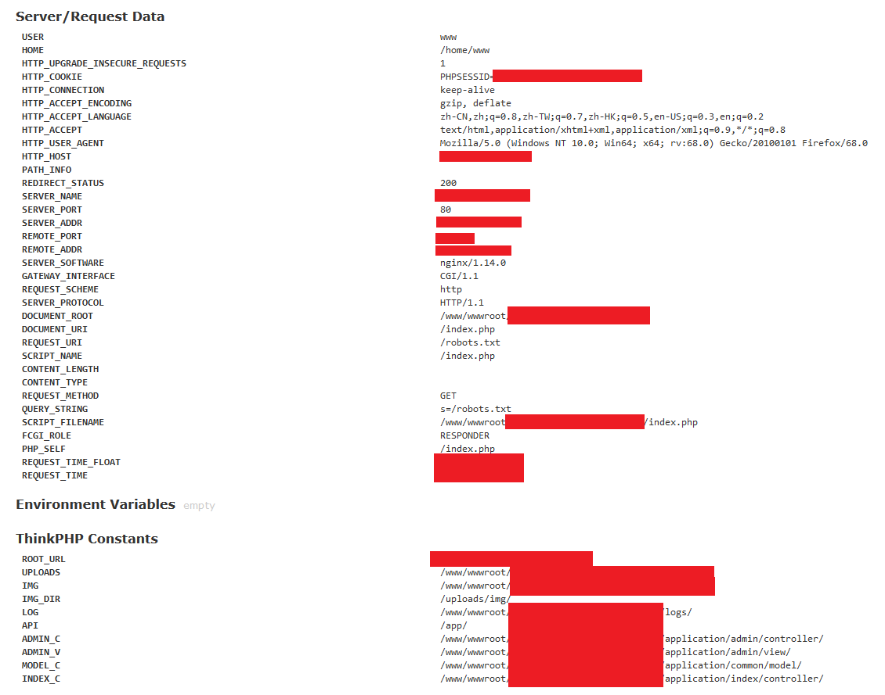

# 0x05 安全配置

## 一、概述

服务端是一种专门为某一客户端设立的，具有针对性的程序，通常都只具备认证与传输数据功能。比如游戏服务端，就是专门为游戏客户端提供服务的，服务的内容包括为客户端提供登录服务，保存游戏玩家资料，提供玩家在线游戏等。而游戏客户端的登陆，就需要服务端的授权，服务器登录要是存在问题，就会使得其他人可以进入服务端，进而引发信息泄露，严重者甚至可能破坏服务端安全配置。由此，服务端安全配置的安全问题不可小视。

服务端配置安全，是保障网站安全性的第一步也是最重要的一步，以下为零时科技安全团队被授权测试交易所的相关测试项及部分案例。

## 二、测试列表

**服务端安全配置**

- 后端服务组件配置测试

- 服务器登录安全测试

- 文件扩展名解析测试

- 备份文件测试

- 测试文件测试

- 测试接口暴露

- HTTP方法测试

- Web前端跨域策略测试

- Web安全响应头部测试

- 弱SSL/TLS加密，不安全数据传输测试

- 非加密信道传输敏感数据测试

- 弱口令及默认口令探测

- 管理后台发现

  

## 三、案例分析

### HTTP方法测试

WebDAV是一种一种基于 HTTP 1.1协议的通信协议，它支持GET、POST、HEAD、PUT、DELETE等HTTP方法，这些方法使应用程序可对Web Server直接读写，并支持写文件锁定及解锁，还可以支持文件的版本控制。

WebDAV虽然方便了网站管理员对网站的管理，但是也带来了新的安全风险。如PUT方法自身不带验证机制，利用PUT方法可以向服务器上传文件，所以恶意攻击者可以上传木马等恶意文件；DELETE方法可以删除服务器上特定的资源文件，造成恶意攻击等有害操作。所以如果要使用WebDAV，务必禁止不必要的HTTP 方法，以防被其他攻击者利用。

以下为零时科技安全团队在对交易所进行测试时，发现使用不安全的HTTP方法的案例。使用OPTIONS请求，可返回网站支持的HTTP方法，由图可看出网站开启了PUT，DELETE等有害方法。由于测试时及时反映给了厂商，厂商也及时进行了修复，故没有利用该漏洞进行下一步测试。

顾及到该漏洞危害巨大，如果各大交易所有此类开启不安全HTTP方法的网站，零时科技安全团队建议及时修复，以规避不必要的安全风险。

 

### 管理后台探测

网站管理后台对于测试人员来说都已经相当熟悉，稍微解释一下，管理后台是对网站数据库和文件的快速操作和管理系统，可使得前台内容能够得到及时更新和调整。管理后台的功能繁多而强大，每个恶意攻击者也会想尽办法攻进后台，而正所谓“能力越大责任越大”，一旦管理后台被恶意攻击者占领，基本也就宣布该权限下的“阵地”已经全部失守，所有数据也任人宰割。但由此也可见得后台保护的重要性，那么如何使得后台不被攻破呢？最简单的办法无非就是把后台藏起来了。所以网站后台的隐藏也就成了保护网站的重要步骤。

零时科技安全团队在对某交易所进行安全测试时，发现该交易所的管理后台地址为其子域名的admin的MD5形式。对后台进行弱口令测试后，发现确实存在弱口令，以此直接进入了后台，所有数据一览无余。

零时科技安全团队建议：各大交易所如有条件，可不将后台管理入口暴露在外网中或设置可登录的ip白名单；如不得不将后台管理入口置于外网，请尽量设置安全性高的验证码机制，使用安全性高的管理平台和复杂度足够的管理员密码，以规避不必要的风险。

### 后台服务组件配置测试

安全意识不佳的网站管理者在使用后台服务组件时可能会选择默认配置，并不做个性化的改动。而当今的很多漏洞想要被用来发挥破坏性，也需要破除很多此类的限制——在很多个性化的配置下，大多数的漏洞是无法应用的。

零时科技安全团队在对某交易所进行安全测试期间，发现访问该交易所的门户网站中不存在的目录时，由于该网站的管理员配置不当，网站会爆出一些敏感信息，如物理路径，真实IP等。这些信息会对攻击者的后续攻击提供便利，大大减少攻击难度，攻击成本。

### 弱口令及默认口令探测 

弱口令没有很明确的定义，一般指的是易被猜到或破解的口令。易被破解的如仅包含简单数字的”123456“；仅包含字母的”abcabc“，”qazwsx“等。易被猜到的如一些生日密码，姓名缩写密码，身份证后6位等。

默认口令是指很多网站后台密码或者用户密码为初始默认状态，并没有做二次更改的口令。例如：“admin”，“111111”，身份证后六位等。这种口令的易猜解易破解性，使得攻击成本与难度大大降低，攻击者有时可以轻易登录相关账号，进入用户账户或网站后台，获取非法权限，做出恶意操作。如对用户的相关信息进行更改，或发布一些恶意消息或文件；恶意修改网站信息和配置，导致网站信息混乱或攻击者借此拿到更高权限，进一步攻击等。

由此，对于相关工作人员安全意识的培养，对于弱口令及默认口令的及时修改和复杂度加强，就显得尤为重要，刻不容缓。

零时科技安全团队对交易所进行测试时，就曾经以猜解弱口令的方式直达后台，轻易拿下网站权限。正如前文所提到的关于安全意识的内容，一百个人里总有一个人在使用弱口令，而那一个人就会因为攻击成本如此低廉成为被攻击的目标。

---

**配置之于安全，犹如水之就下。**

**非之，则如蚁穴之于千里之堤。**

**棋差一招，满盘皆输。**

**注：以上所有测试均已经过相关交易所授权，请勿自行非法测试。**

