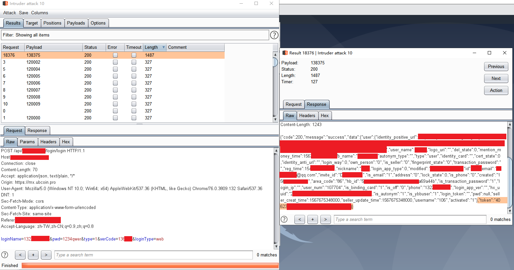

# 0x07 用户认证

## 一、概述

用户认证安全方面的安全问题也许单单从技术层面上讲，并不是一种非常复杂的问题，因为解决起来并不怎么困难；但如果从交易所的实际交易业务层面来看，用户认证方面如果存在安全隐患，那将是非常可怕的。简单试想一下，如果一个黑客可以通过任意账号的用户认证，那这位攻击者会对那些账户里的余额做什么呢......

这只是用户认证安全问题的一个小例子，当然同类的问题还有很多，虽然不尽相同，但其破坏性影响是同样可怕的。零时科技安全团队已经对此类问题做了一些整理，详情可见以下的测试列表，建议各大交易所以此列表自查，规避不必要的安全风险。

## 二、测试列表

> **用户认证**
>
> - 用户注册过程测试
> - 用户登录过程测试
> - 找回密码过程测试
> - 设备解绑过程测试
> - 验证码策略测试
> - 帐户权限变化测试
> - 帐户枚举测试
> - 弱密码策略测试
> - 口令信息加密传输测试
> - 默认口令测试
> - 帐户锁定机制测试
> - 认证绕过测试
> - 浏览器缓存测试
> - 权限提升测试
> - 授权绕过测试

## 三、案例分析

### 口令信息加密传输测试

“反正数据包也只是在用户和交易所之间传输的，口令要加密干什么”，可能有部分粗心大意的开发人员会这么想，但事实真的是这样吗？口令加密真的没有用吗？显而易见，事实当然不是这样的。但可能有的开发人员真的会这么想，所以口令信息不加密即传输成为了各大交易所中最常见的问题之一。

口令加密的好处很多，比如可在一定程度上防止爆破；比如用户登录交易所期间被中间人攻击时，攻击者截获的数据包中若没有明文口令信息，即可使攻击者无法轻易获取口令等等。零时科技安全团队在对某交易所进行测试时，发现该交易所的口令信息在传输时已被前端加密。零时科技团队安全研究员随即审计网站前端js代码，寻找登录/重置密码时需要提交的参数，并在找到后，按js内容要求构造未加密数据包向api请求，所幸该某交易所对非加密数据包也敞开怀抱，即使是明文数据包，只要参数正确也可发挥作用。最后通过该漏洞和其他漏洞配合，成功登进其他用户账户。

零时科技安全团队建议，各大交易所在传输口令信息时，能够使用加密传输的方式，且最好不要留下加密算法的明显线索（加密用何种算法，密钥是什么等），保障信息安全。

### 用户登录过程测试

爆破，即暴力破解，意指使用大量可能有效的潜在答案一一尝试，最后留下确实有效答案的攻击手法。爆破虽然笨重但却经常有效；虽然常有奇效，但也确实要和某些其他问题合作才能发挥功能。

零时科技安全团队对某交易所进行安全测试时，发现该交易所的某交易所在账号登录处存在问题，虽然限制每个用户的登录试错次数，但并不限制同一IP对不同用户尝试登录的请求数量。零时科技安全研究员随即对该交易所实施了撞库攻击，最终成功破解出部分用户口令。

零时科技安全团队建议，各大交易所在登录页面应同时使用图形或更复杂的验证码；对同一IP发出的请求频率和数量进行限制。

### 验证码策略

验证码在某些情况下有着极强的安全作用，但如若使用不当或有所疏漏，也会留下安全隐患。看似有验证码放心了不少，其实有可能只是一件“皇帝的新衣”。零时科技安全团队在对某交易所进行安全测试时发现，该交易所在手机登录处需要向用户发送验证码并进行校验。该交易所验证码长度6位，貌似安全性较高，但实则可发现具有递增趋势且递增速度缓慢，爆破验证码时可以轻易确认当前验证码所在范围。对于交易所来说，这样的验证码机制就是“皇帝的新衣”；对于攻击者来说，更降低了攻击成本，提高了攻击效率。

零时科技安全团队建议各大交易所使用验证码保障自身安全时，应使用随机多位的验证码，有条件的话最好使用字母和数字混杂的高强度验证码，并限制验证码输入错误的次数，采取一定措施。

---

**假作真时真亦假，但凭伪造之证，信手指鹿为马，登堂入室。尔用户之安危，岂非人为刀俎，我为鱼肉乎？**

*注：以上所有测试均已经过相关交易所授权，请勿自行非法测试。*

